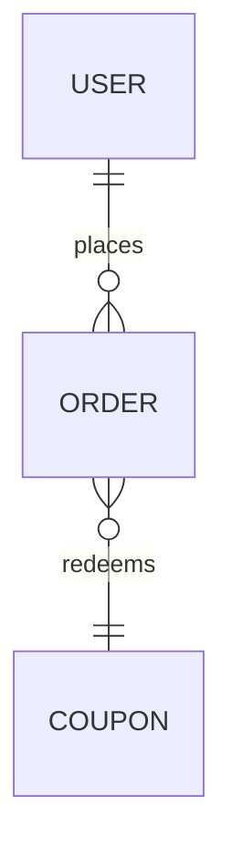

## When the model earns a diagram

Fire only when the requirement ledger implies persistent data with structure:
two-plus entities, or any change to a relation between existing ones — a new
foreign key, a cardinality flip, a join table, an ownership move. Below that
threshold — a single flat table, a new column, a config value — stay silent;
prose or a payload table carries the decision fine.

The trigger reads the ledger, not the prompt: "add tags to posts" implies two
entities and a relation, so it fires; "add a bio field to users" does not.

## Consent gate — shared with visual-decisions

The visual-decisions skill owns the session's fidelity consent question
(Full mockups / Quick ASCII only / No mockups). One answer governs both skills:

- Already answered this session? Reuse it. Never re-ask — the answer holds all
  session regardless of which skill triggered the gate first.
- Never asked? Ask it now via `AskUserQuestion`, in the exact wording of the
  visual-decisions consent gate; the answer then covers that skill too.
- On "No mockups": present the model as a mermaid code block in chat plus the
  approve/amend question — no server, no SVG, no ASCII art.

## Flow

1. **Draft the model from the ledger.** Entities with key attributes only —
   primary keys, foreign keys, and the discriminators that decide row identity
   (status, type, deleted_at). Never every column: the diagram settles shape,
   not storage. Relations carry cardinality (1-1, 1-N, N-M) taken from ledger
   rows, with a named guess wherever the ledger is silent.
2. **Check for a structural fork.** Most models have one defensible shape;
   render those as a single ERD. A genuine fork exists when the ledger supports
   two-plus shapes with different implementation costs:
   - normalized vs denormalized
   - join table vs JSON column
   - single-table inheritance vs polymorphic association
   - hard delete vs soft delete
   On a fork, render 2–3 variant ERDs at equal fidelity and ask the pick via
   `AskUserQuestion`: one option per variant letter plus its one-line tradeoff.
   A mix answer gets ONE merged variant and one re-ask — at most two passes.
3. **Approve or amend.** Show the picked model and ask: approve as-is, or name
   the amendment. Amendments re-render and re-ask; loop until an explicit
   approval lands. No approval, no spec section.
4. **Write the spec section.** Embed the approved model as `## Data Model` in
   the spec (format below) and record the approval as a CLEAR ledger row with
   the diagram file or chat message as its source.

## Preview rendering

Full-mockups tier: hand-built inline SVG in crow's-foot notation, written to
the shared preview server's reserved `diagram.html` slot in `taskmaster-docs/mockups/`.
Server mechanics are visual-decisions' own, reused as-is:

- Server not running? Start
  `../visual-decisions/assets/serve.py --port "${PREVIEW_PORT:-8123}"` in the
  background and note the PID (normalized fallback chain: serve.py →
  `python3 -m http.server "${PREVIEW_PORT:-8123}" --bind 127.0.0.1 -d taskmaster-docs/mockups` →
  no python3 → `php -S 127.0.0.1:${PREVIEW_PORT:-8123} -t taskmaster-docs/mockups` →
  `npx serve taskmaster-docs/mockups`). Port busy?
  `lsof -ti :${PREVIEW_PORT:-8123}` — reuse a prior mockup server, else bump the port.
- Write every pass to `diagram.html` — the user's open tab sees each revision
  in place. The slot is per-purpose: never overwrite `current.html` or the
  other reserved files.

Hand-built means hand-built: no mermaid.js, no external assets, no fetched
fonts or scripts, nothing animated. A rect-and-text SVG renders in any tab
and needs no network.

Quick-ASCII tier: box-drawing entities with relation arrows, straight in chat:

```
+------------+       +---------------+       +----------+
|   User     |1     N|   Order       |N     1|  Coupon  |
|------------|-------|---------------|-------|----------|
| id PK      |       | id PK         |       | id PK    |
| email      |       | user_id FK    |       | code     |
+------------+       | status        |       +----------+
                     +---------------+
```

## SVG layout rules

- Left-to-right layers following relation direction: parents and owners on the
  left, children and dependents to the right — a reader scans ownership the
  way the data flows.
- Crow's-foot markers on the edges carry cardinality; label an edge with the
  relation's verb when it disambiguates ("user *places* order").
- Key attributes inside the entity box, PK/FK tagged; discriminators listed,
  everything else omitted.
- Above ~10 entities, split into per-subdomain diagrams — one per bounded
  cluster, rendered as separate passes. Never one mega-diagram: past ten
  entities the edges cross and the picture stops answering questions.

## The spec artifact — Data Model section

The approved model lands in the spec as a `## Data Model` section containing:

- A mermaid `erDiagram` code block — GitHub- and IDE-native, renders in the
  repo, diffs like text. The mermaid block is the durable form; the SVG and
  ASCII previews were throwaway approval aids.
- One line per entity below the block: **ownership** (which feature writes it)
  and **lifecycle** (created / updated / deleted by what).

````
## Data Model



- USER — owned by auth; created at signup, soft-deleted by the GDPR job.
- ORDER — owned by checkout; created at purchase, never deleted.
````

State it in the spec: this section is a **binding contract**. Implementation
task cards that touch persistence must conform to the approved erDiagram; a
deviation discovered mid-card goes back through model re-approval, never into
silent schema drift.

## Defer — what this skill refuses to do

- SQL, DDL, or migration files — the approved model is the deliverable; schema
  code belongs to the database plugin at implementation time.
- Reverse-engineering an existing schema into a diagram — out of scope; this
  skill draws models that do not exist yet.
- Layout variants, user flows, architecture topology — the visual-decisions
  skill; erd draws entities and relations, nothing else.

## Anti-patterns

- Every-column entity dumps — a 30-attribute box buries the keys that decide
  the shape; the diagram is structure, not a data dictionary.
- mermaid.js (or any external asset) in the preview — mermaid is the spec
  format, hand-built SVG is the preview format; never confuse the two.
- Re-asking fidelity consent when visual-decisions already asked this session.
- One mega-diagram past ~10 entities instead of per-subdomain splits.
- Generating DDL or migrations "since the model is approved" — implementation
  starts after the cards.
- Firing on a single flat table or a column addition — below threshold the
  skill stays silent.
- Rendering variants when no structural fork exists — variant theater spends
  the user's attention on a non-decision.
